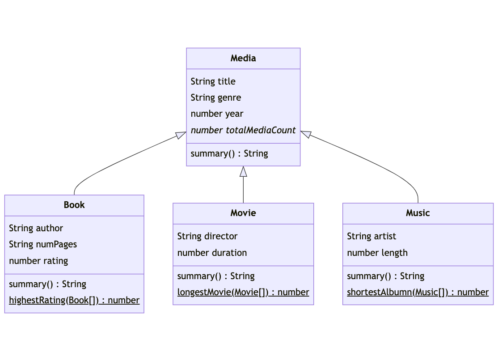

# Virtual Library 📚

You're building a virtual library app, and you need to create a set of classes to represent different types of media. You'll have books, movies, and music, each with their own unique properties. You'll need to create a base class for all media, and several subclasses for specific types of media. You'll also need to create a static method to keep track of the total number of media items in the library.

### Running Code and Tests 

1. You can run any of the files with the command `node PATH_TO_FILE`.
2. To run the tests, do the following in the root folder of this project:

```shell
npm install
npm test
```



*Underlined items are static method. Italicized items are static properties*

## `Media` Class

1. In `Media.js`, create a `Media` class. The `Media` class should have the following properties and methods:
    - `title`: the title of the media (string)
    - `year`: the year the media was produced (number)
    - `genre`: the genre of the media (string)
    - `totalMediaCount`: A static property that tracks how many Media items have been created
    - `summary()`: a method that returns a summary of the media (string) as `"Title: <TITTLE>, Year: <YEAR>, Genre: <GENRE>"`
2. Export the `Media` class using `module.exports`.
3. In `index.js`, import `Media` using `require`.

### Examples

```javascript
const book = new Media('The Catcher in the Rye', 1951, 'Fiction');
Media.totalMediaCount; // 1
const music = new Media('Abbey Road', 1969, 'Rock');
Media.totalMediaCount; // 2
music.summary(); // "Title: Abbey Road, Year: 1969, Genre: Rock"
```

## `Book` Class

1. In `Book.js`, create a `Book` class. The `Book` class should be a subclass of `Media`. Import `Media` into the `Book.js` file using `require`. 
2. `Book` should have the following properties and methods:
    - `author`: the author of the book (string)
    - `numPages`: the number of pages in the book (number)
    - `rating`: the average rating of the book (number between 1-5)
    - `summary()`: a method that returns a summary of the book, including the author, number of pages, and rating (string) as `"Title: <TITTLE>, Author: <AUTHOR>, Year: <YEAR>, Page Count: <NUM_PAGES>, Genre: <GENRE>, Rating: <RATING>"`
3. The `Book` class should have a static method `highestRating` that takes an array of `Book` items and returns the `Book` with the highest rating.
4. Export the `Book` class using `module.exports`.
5. In `index.js`, import `Book` using `require`.

### Examples
```javascript
const book1 = new Book('To Kill a Mockingbird', 1960, 'Fiction', 'Harper Lee', 281, 4.4);
Media.totalMediaCount; // 1
const book2 = new Book('The Bluest Eye', 1970, 'Fiction', 'Toni Morrison', 206, 4.6);
Media.totalMediaCount; // 2
book1.summary(); // "Title: To Kill a Mockingbird, Author: Harper Lee, Year: 1960, Page Count: 281, Genre: Fiction, Rating: 4.4"
Book.highestRating([book1, book2]); // Returns book2
```

## `Movie` Class

1. In `Movie.js`, create a `Movie` class. The `Movie` class should be a subclass of `Media`. Import `Media` into the `Movie.js` file using `require`. 
2. `Music` should have the following properties and methods:
    - `director`: the director of the movie (string)
    - `duration`: the duration of the movie in minutes (number)
    - `rating`: the average rating of the movie (number between 1-5)
    - `summary()`: a method that returns a summary of the movie, including the director, duration, and rating (string) as `"Title: <TITTLE>, Director: <DIRECTOR>, Year: <YEAR>, Genre: <GENRE>, Duration: <DURATION>, Rating: <RATING>"`
3. The `Movie` class should have a static method `longestMovie` that takes an array of `Movie` objects and returns the `Movie` with the longest duration.
4. Export the `Movie` class using `module.exports`.
5. In `index.js`, import `Movie` using `require`.

### Example
```javascript
const movie1 = new Movie('Inception', 2010, 'Sci-Fi', 'Christopher Nolan', 148, 4.5);
const movie2 = new Movie('The Godfather', 1972, 'Crime', 'Francis Ford Coppola', 175, 4.7);
Media.totalMediaCount; // 2
movie1.summary(); // "Title: Inception, Director: Christopher Nolan, Year: 2010, Genre: Sci-Fi, Rating: 4.5"
Movie.longestMovie([movie1, movie2]); // Returns movie2
```

## `Music` Class
1. In `Music.js`, create a `Music` class. The `Music` class should be a subclass of `Media`. Import `Media` into the `Music.js` file using `require`. 
2. `Music` should have the following properties and methods:
    - `artist`: the artist of the music (string)
    - `length`: the length of the music in seconds (number)
    - `summary()`: a method that returns a summary of the music, including the artist, album, and length (string) as `"Title: <TITTLE>, Artist: <ARTIST>, Year: <YEAR>, Genre: <GENRE>, Length: <LENGTH>"`
3. The `Music` class should have a static method `shortestAlbum` that takes an array of `Music` objects and returns the `Music` object with the shortest song length.
4. Export the `Music` class using `module.exports`.
5. In `index.js`, import `Music` using `require`.

```javascript
const music1 = new Music('Lemonade', 2016, 'R&B', 'Beyonce', 'Lemonade', 3949);
const music2 = new Music('Renaissance', 2022, 'R&B', 'Beyonce', 'Beyonce', 3734);
Media.totalMediaCount; // 2
music2.summary(); // "Title: Renaissance, Artist: Beyonce, Year: 2022, Genre: R&B, Length: 3734 seconds"
Music.shortestAlbum([music1, music2]); // Returns music2
```

## Stretch: Enhance Your Library 🚀
1. Create a class of `Podcast` that is a subclass of `Music`. `Podcast` should inherit all of the properties and methods from the `Music` class and have an additional properties and methods of:
    - `host`: A string with the name of the host.
    - `episodeName`: A string with the name of the episode
    - `episodeNumber`: A number with the episode number.
    - `guests`: An array of the guests on the particular episode.
    - `listen()`: Methods that returns the string `<TITLE> - Episode: <EPISODE_TITLE>. Hosted by <HOST> and featuring guests <GUESTS>. Length: <LENGTH> seconds.`
2. Add a static method to `Book` and `Movie` called `calculateAverageRating()`: This should accept an array of `Book` or `Movie` objects and return the average rating for these objects.
3. In `Media` create a static property of `ALL_MEDIA`. This should be an array that contains all `Media` objects created using the class.